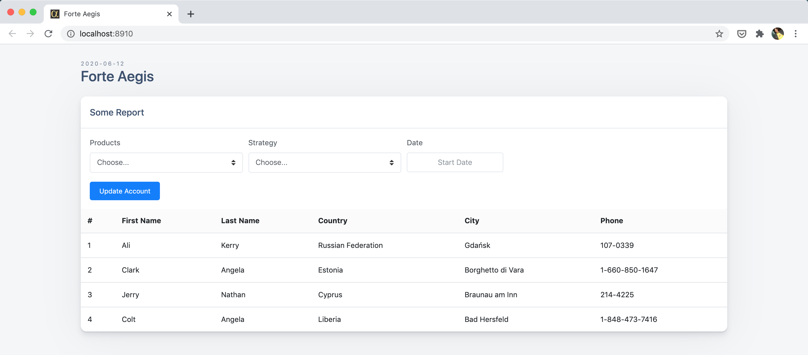

# ForteAegis - Viewer

Ui interface for viewing FA data
 

### Setup & Start

- `yarn install` in root directory
- `rw dev` to start frontend UI in dev mode
- `sls offline` to start serverless backend locally in offline mode

Your browser should open automatically to `http://localhost:8910` to see the web app.

### Configure Continuos Deployment from Github Action to AWS

- Create a user in AWS IAM with AWS deploy policy
- Copy `Access key ID` and `Secret access key` for that user
- Create Secrets in github repo settings with name `AWS_ACCESS_KEY_ID` and `AWS_SECRET_ACCESS_KEY` with values from above

### Deploy directly from Local to AWS

- `sls deploy`

## Preview

### Built using [Redwoodjs.com](https://redwoodjs.com)
